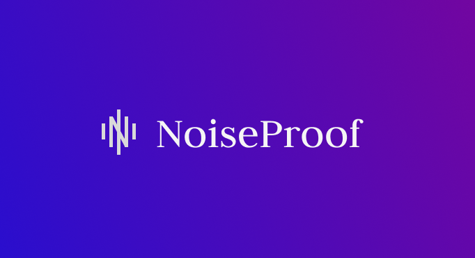

---
# 騒音証明アプリ - NoiseProof -
 
 
---

# 🌏 サービスURL
### https://noise-proof.com/ 
 

# ■ サービス概要

NoiseProofは、騒音に悩む人が「客観的な証拠」として状況を整理・記録し、管理人などに冷静に相談できるよう支援するWebアプリです。

録音・dB測定・位置情報（任意）を記録し、発生した騒音を客観的にログとして残すことができます。

状況に応じてPDF形式の診断書を出力することもでき、必要に応じて管理人や第三者に提出する手段として活用可能。

さらに、他人の投稿や共感・コメント機能を通じて、気持ちを整理できるサポート環境を備えています。

「この程度で相談していいのか？」という迷いを乗り越え、スムーズな相談の第一歩を後押しします。

---
 

# ■ このサービスへの思い・作りたい理由

私自身、集合住宅での騒音に悩んだ経験があります。

管理会社に相談しようとしたものの、「どんな音？」「いつ・どこで？」「どのくらいうるさかった？」と細かく聞かれ、説明がうまくできず、何度もやり取りが発生しました。

そのとき「最初から必要な情報がそろっていれば、もっとスムーズだったのに」と強く感じました。

このアプリでは、録音・dB・位置などを記録、整理、分析することで、説明の負担を減らします。

このサービスは“訴える”ためではなく、“相談する勇気”を支えることを目的としています。

そのため、「まずは管理人さんに伝える」ことを目的としており、警察や裁判などを前提とした証拠収集ツールとは一線を画します。

---
 

# ■ ユーザー層

- 集合住宅で騒音トラブルに悩んでいる人
- 「これくらいで相談していいのか？」とためらっている人
- 管理人への相談を検討しているが、証拠がなく困っている人
- うまく状況を説明できるか不安な人

---
 

# ■ サービスの利用イメージ

1. 騒音が気になったタイミングで、アプリを開き録音
2. dB測定が記録され、任意で位置情報も追加して騒音ログとして保存
3. 残しておきたい録音に対してレポートを作成（騒音の種類や状況などを追加）
4. 必要なレポートをまとめて「診断書」を作成（PDFとして保存可）
5. 管理人に提出することで、冷静に状況を伝える
6. グラフ分析機能で、過去1週間のデータを可視化

（＋）悩んだ時には、他人の投稿やコメントからヒントを得ることも可能

---
 

# ■ サービスの差別化ポイント

- **簡単操作**：いつでもどこでも簡単に記録できるので、騒音発生時にすぐ証拠を残せる
- **客観的な証拠の提供**：騒音の事実を数値とグラフで「見える化」し、感情的な訴えではなく、データに基づいた説得力ある診断書を作成
- **診断書内の視覚化**：時間帯別分析、dB分析、種類別分析、音量分布など、選択したレポートの騒音パターンを視覚的に表示
- **データ分析機能**：過去1週間のデータを可視化し、長期的な騒音傾向を把握できる
- **共感とサポートが得られるコミュニティ機能**：「相談していいのか不安…」そんなときは、他人の投稿やコメントからヒントや安心を得られます。同じ悩みを持つ人との交流によって、実践的な解決策だけでなく、精神的な支えも得られる仕組みです。
- **"管理人に伝えるため"のツール設計**：訴訟ではなく日常的な相談を前提とした仕組み

---
 

# 💻 機能紹介

| 録音機能 |
| :---: | 
||
| 
録音機能では、客観的な証拠を簡単に記録できます。  録音が終了したら、同じボタンをタップして停止します。停止後に表示され る「保存」ボタンを押すと、音量データが保存されます。 また、任意で位置情報を録音データに紐づけることも可能です。位置情報を連携させることで、後に診断書を作成する際に、より説得力のある内容になります。
 |
 

| レポート作成機能 |
| :---: | 
||
| 
録音データに情報を加えて、最新の録音からレポートを作成することができます。 騒音の種類（足音、音楽など）、発生場所の詳細、状況メモなどを追加入力することで録音データに情報を加えてレポートとして記録することができます。  さらに必要に応じてレポートをPDF保存することもできます。
 |
 

| 診断書作成機能 |
| :---: | 
||
| 
複数のレポートをまとめて、管理会社や第三者へ提出できる「診断書」を作成できます。 診断書では、選択したレポートのデータをグラフなどから統計的に確認することが可能です。  さらに必要に応じてレポートをPDF保存することもできます。
 |
 

| データ分析機能 |
| :---: | 
||
| 
初回登録以降の総録音回数・レポート件数・診断書件数・総録音時間を一目で確認できるほか、直近1週間の録音活動や、録音された音を騒音の種類ごとに分類・集計した詳細データも閲覧可能です。 日別の録音数やレポート提出状況を一覧表示します。 騒音の種類ごとの件数・累積時間・平均/最大デシベルを自動集計します。 ノイズの傾向や発生パターンの可視化で、証拠管理や振り返りに最適です。
 |
 

| コミュニティ機能 |
| :---: | 
||
| 
コミュニティ機能ではユーザー同士が騒音に関する悩みや体験を投稿することができます。 診断書では、選択したレポートのデータをグラフなどから統計的に確認することが可能です。  騒音の種類・発生頻度・日時などを選んで、困りごとを簡単に投稿します。 他のユーザーの投稿にコメントして、共感やアドバイスを気軽にやりとりできます。コメントは非同期で行われます。 「いいね」で共感を示すことも可能です。いいねも非同期で行われます。
 |
 

# ■ 使用技術 / 技術構成

### 録音システム

- **MediaRecorder API**
  ブラウザネイティブの録音機能を活用し、ユーザーのマイクから直接高品質な音声をキャプチャ
  録音データは内部的にBlob形式で生成・処理され、バックエンドAPIへ転送

### 音響解析システム（擬似dB測定エンジン）

- **Web Audio APIによる高度な音響処理**
- AudioContextとAnalyserNodeを組み合わせた精密な波形分析
- getByteTimeDomainData()メソッドによる波形データ取得
- RMS（二乗平均平方根）アルゴリズムによる信号強度の数学的変換
- 対数スケールを用いた人間の聴覚特性に近似したdB値算出

### リアルタイム可視化エンジン

- **Canvas APIによる高パフォーマンスなグラフィックレンダリング**
- カスタム設計された波形表示アルゴリズム
- 視覚的フィードバックのためのカラーグラデーションマッピング
- 複数の表示モード（録音・再生）に対応した柔軟なビジュアライザー

### 位置情報統合システム

- **Geolocation APIを活用した位置情報の高精度取得**
- **Google Maps Geocoding API**：緯度経度から住所へ変換
- 騒音データと地理的コンテキストの統合
- ユーザープライバシーに配慮した権限管理と設定保存機能

### SNSログイン（Google）
- **Google OAuth2.0**によるSNSログイン機能 を導入
- ワンクリックでログイン可能な認証フローにより、ユーザー体験を向上

### 録音データの送信・保存

- **Google Cloud Storage (GCS)**
  Googleのクラウドストレージサービス。録音データの安全かつスケーラブルな保存に利用。

### PDF生成

- **html2pdf.js（JavaScriptライブラリ）**
クライアントサイドで録音情報・位置情報などをPDF形式で出力。
ワンクリックで即時PDF保存が可能。

### ユーザーインターフェース

- **ReactとTailwind CSSによる高度にインタラクティブなUI**
- パフォーマンス最適化されたステート管理
- レスポンシブデザインによるマルチデバイス対応

# ER図

 

# 画面遷移図
https://www.figma.com/design/vty8Z3JNZYb7WAsdLKTzLO/NoiseProof%E3%80%80%E7%94%BB%E9%9D%A2%E9%81%B7%E7%A7%BB%E5%9B%B3?node-id=0-1&p=f&t=WPDTQ1LKQorf1h3f-0
